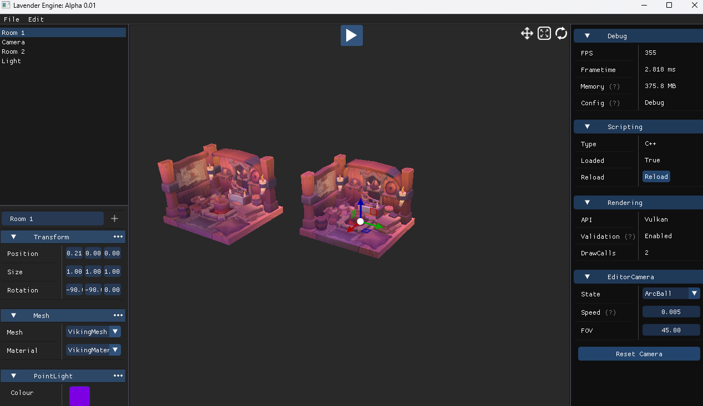
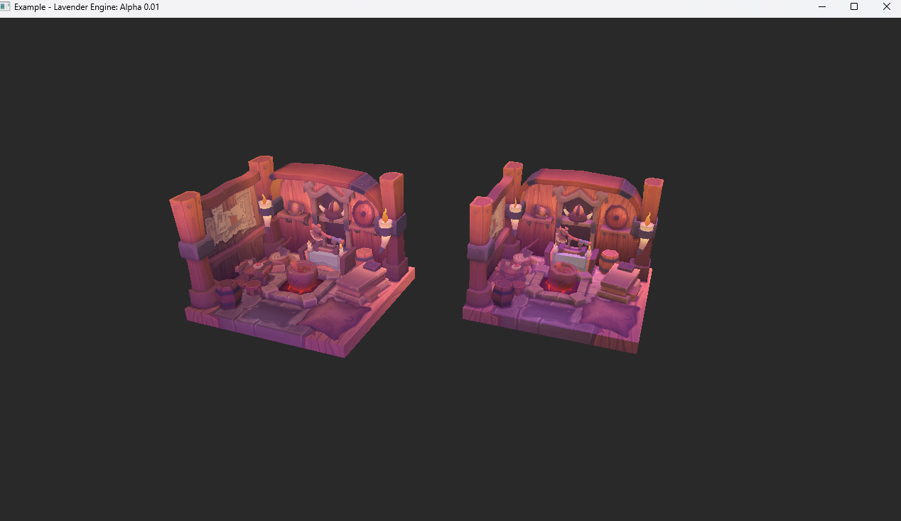

# Lavender

## Overview

This Vulkan 3D Game Engine is a personal project developed using C++ and the Vulkan graphics API. Designed from the ground up to explore the capabilities of low-level graphics programming, this engine focuses on providing a raw and direct interface for rendering operations in a 3D space.

## Features

- **Vulkan Graphics API**: Utilizes Vulkan for efficient low-level graphics rendering. Vulkan's explicit API design offers more control over graphics and compute operations, enabling optimized performance for graphics-intensive applications.
- **C++ Core**: Built with C++, this engine leverages the language's features for high performance and control over system resources. The use of modern C++ standards ensures a balance between efficiency and coding best practices.
- **Window Management**: Integrates with GLFW for window creation and management, providing a simple interface for rendering output and handling user input.

## Limitations

Currently, the engine does not support much. The focus has been primarily on establishing a robust rendering pipeline and understanding Vulkan's intricate API. This limitation opens opportunities for future enhancements and learning.

## Project Status

Here is a showcase of the editor:

The project also supports exporting the game as an executable on Windows & Linux (dev branch).
This shows the project from the editor as an exported game:

This is an ongoing personal project, reflecting my journey into the depths of 3D graphics programming. While it is in its early stages, the foundation laid by this engine paves the way for continuous learning and development. Contributions and feedback are welcome as I aim to expand its capabilities.

## Getting Started

To get started with this Vulkan 3D Game Engine, you'll need to have a basic understanding of C++ and graphics programming. Ensure you have the Vulkan SDK installed on your system along with an appropriate C++ development environment.

1. Clone the repository to your local machine.
2. Go to the scripts directory and run 'vs2022-Generate-Projects.bat' to generate Visual Studio 2022 project files.
3. Explore the example applications to understand the basic operation of the engine.

## Contributions

As a personal project, contributions in the form of feedback, suggestions, or direct code improvements are highly appreciated. If you're interested in contributing, please reach out through the project's repository.
